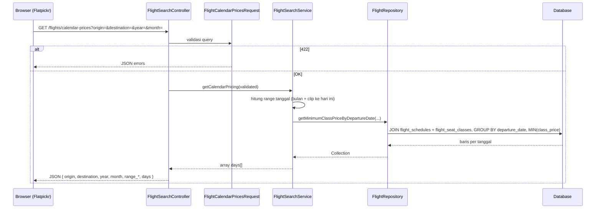

# Menambah fitur — Dynamic Pricing Calendar

Dokumen ini menjelaskan **alur penarikan data harga kalender** (Google Flights–style) agar Anda bisa menambah variasi fitur serupa tanpa merusak lapisan lain.

## Ringkasan fitur

- **Backend:** endpoint JSON `GET /flights/calendar-prices` mengembalikan **harga termurah per `departure_date`** untuk kombinasi **asal + tujuan** (kode bandara) dalam rentang tanggal yang relevan untuk **bulan kalender** yang diminta.
- **Perhitungan harga:** `MIN(flight_seat_classes.class_price)` dikelompokkan per `flight_schedules.departure_date`, difilter `origin` / `destination` pada `flight_schedules`, dibatasi rentang tanggal (lihat aturan di bawah).
- **Frontend:** [Flatpickr](https://flatpickr.js.org/) pada halaman pencarian memanggil endpoint tersebut **secara asinkron** saat kalender dibuka atau bulan/tahun berubah, lalu menampilkan **label harga ringkas** di bawah angka tanggal.

## Alur data (kalender)



## Aturan bisnis di service (rentang tanggal)

`FlightSearchService::getCalendarPricing()`:

1. Menentukan awal/akhir **kalender bulan** (`year` + `month`).
2. **Memotong awal rentang** ke **`today`** jika bulan yang dibuka menyertakan hari-hari yang sudah lewat — agar tidak meng-query atau mengisyaratkan harga untuk tanggal lampau (selaras dengan validasi pencarian utama).
3. Jika setelah pemotongan tidak ada hari valid (misalnya bulan sepenuhnya di masa lalu), mengembalikan `days: []` tanpa error.

Repository hanya menerima **string tanggal** `Y-m-d` untuk `whereBetween` pada kolom `departure_date`.

## Kontrak respons JSON

Contoh sukses (disederhanakan):

```json
{
  "origin": "CGK",
  "destination": "DPS",
  "year": 2026,
  "month": 5,
  "range_start": "2026-05-01",
  "range_end": "2026-05-31",
  "days": [
    { "date": "2026-05-15", "min_price": 1850000 }
  ]
}
```

- **`days`:** hanya tanggal yang **benar-benar punya** baris hasil agregasi (ada jadwal + minimal satu kelas kursi).
- **`range_start` / `range_end`:** rentang efektif setelah clip ke hari ini; bisa `null` jika tidak ada rentang valid.

## Frontend (AJAX + Flatpickr)

File: `resources/js/flight-calendar.js`

- URL endpoint diambil dari atribut `data-calendar-prices-url` pada `#flight-search-root` di `flights/search.blade.php`.
- Permintaan memakai header `Accept: application/json` dan `X-Requested-With: XMLHttpRequest` agar konsisten dengan ekspektasi Laravel untuk respons JSON saat error validasi.
- **AbortController** membatalkan fetch sebelumnya jika pengguna berganti bulan dengan cepat, sehingga respons kadaluarsa tidak menimpa data terbaru.
- Hook **`onDayCreate`** membaca `dayElem.dateObj`, memetakan ke `Y-m-d`, lalu menambahkan node teks harga jika ada di peta hasil fetch.
- Ganti asal/tujuan pada `<select>` memicu **fetch ulang** untuk bulan yang sedang tampil.

## Menambah variasi fitur (pola yang disarankan)

| Kebutuhan | Sentuh di mana |
|-----------|----------------|
| Ubah definisi “harga termurah” (mis. hanya economy) | `FlightRepository::getMinimumClassPriceByDepartureDate()` — tambah `where` pada join |
| Batasi maskapai / status penerbangan | Repository (filter pada `flight_schedules`) |
| Cache per bulan | `FlightSearchService::getCalendarPricing()` — bungkus hasil repository |
| Ubah bentuk JSON | Controller + dokumentasi kontrak; sesuaikan `flight-calendar.js` |
| Ganti library kalender | Ganti modul JS; pertahankan kontrak endpoint agar backend stabil |

## File terkait

| File | Peran |
|------|--------|
| `routes/web.php` | Rute `flights.calendar-prices` |
| `app/Http/Controllers/FlightSearchController.php` | `calendarPrices()` → JSON |
| `app/Http/Requests/FlightCalendarPricesRequest.php` | Validasi query + respons 422 JSON |
| `app/Services/FlightSearchService.php` | `getCalendarPricing()` |
| `app/Repositories/FlightRepository.php` | Agregasi SQL/Eloquent |
| `resources/js/flight-calendar.js` | Flatpickr + fetch |
| `resources/css/app.css` | Override tema gelap Flatpickr |
| `resources/views/flights/search.blade.php` | Input tanggal + `data-calendar-prices-url` |

Lihat juga [ARCHITECTURE.md](./ARCHITECTURE.md) untuk konteks lapisan MVC + Repository + Service secara keseluruhan.
