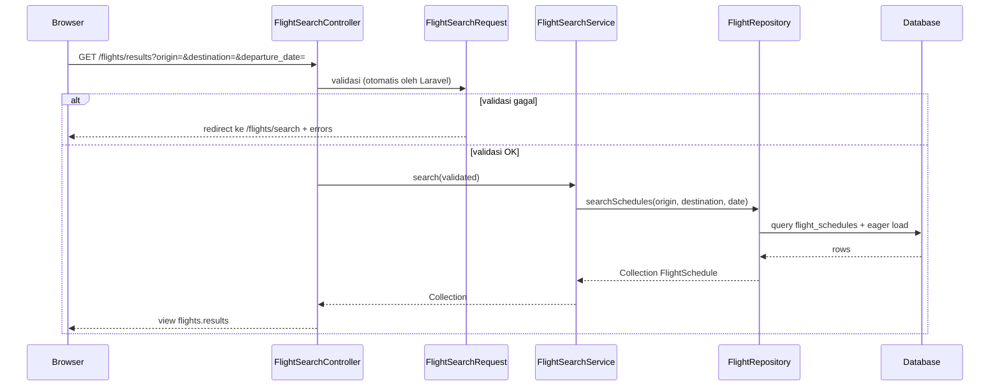
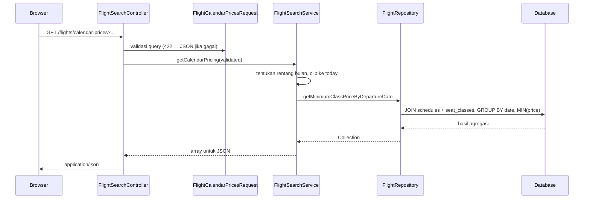

# Arsitektur — Flight Search (MVC + Repository + Service)

Dokumen ini menjelaskan **alur data** dari permintaan HTTP hingga basis data, serta **batas tanggung jawab** setiap lapisan agar kode tetap *decoupled* dan mudah diuji atau diganti implementasinya.

## Ringkasan lapisan

| Lapisan | Peran | Contoh di proyek ini |
|--------|--------|----------------------|
| **View** | Menampilkan UI; tidak berisi logika bisnis | `resources/views/flights/*.blade.php`, `layouts/app.blade.php` |
| **Controller** | Menjembatani HTTP: memanggil Service, mengembalikan view | `FlightSearchController` |
| **Form Request** | Validasi dan normalisasi input HTTP | `FlightSearchRequest` |
| **Service** | Aturan bisnis dan orkestrasi use case | `FlightSearchService` |
| **Repository** | Akses data (query Eloquent); tersembunyi dari Service | `FlightRepository` (+ interface) |
| **Model** | Pemetaan tabel dan relasi Eloquent | `FlightSchedule`, `Airport`, dll. |

**Dependency rule (satu arah):**  
`Controller → Service → RepositoryInterface → FlightRepository → Model / DB`  
Controller **tidak** memanggil `FlightRepository` langsung; Service **tidak** bergantung pada implementasi konkret repository, melainkan pada **`FlightRepositoryInterface`** yang di-*bind* di `AppServiceProvider`.

## Alur data (permintaan pencarian)

### Langkah per komponen

1. **Browser** mengirim formulir pencarian dengan metode **GET** ke named route `flights.results`, sehingga URL bisa dibagikan dan di-*bookmark*.
2. **`FlightSearchRequest`** (otomatis di-*resolve* sebelum `results()` jalan) menormalisasi `origin` dan `destination` ke huruf besar, lalu memvalidasi format dan aturan bisnis input (misalnya tujuan berbeda dari asal, tanggal tidak sebelum hari ini).
3. **`FlightSearchController::results`** hanya mengambil array **`validated()`**, meneruskannya ke **`FlightSearchService::search`**, lalu me-render view dengan data yang sudah jadi.
4. **`FlightSearchService`** memuat *use case* “cari jadwal”: saat ini ia meneruskan kriteria ke repository; ke depan Anda bisa menambah aturan (cache, filter harga, sorting khusus) **tanpa mengubah** controller atau query SQL di banyak tempat.
5. **`FlightRepository`** menjalankan **satu query** yang difokuskan pada `FlightSchedule`, dengan **`with()`** untuk `airline`, `route` (+ bandara asal/tujuan), dan `seatClasses` agar view tidak memicu *N+1 query*.
6. **Interface + binding** — `AppServiceProvider::register()` memetakan `FlightRepositoryInterface` → `FlightRepository`. Untuk pengujian atau penyimpanan lain, cukup ganti binding (misalnya ke *fake repository*) tanpa menyentuh Service.

## Halaman formulir pencarian

- **GET `/flights/search`** memanggil `FlightSearchService::getAirportsForForm()`, yang melalui repository membaca daftar bandara untuk *dropdown*.
- Controller mengembalikan view `flights.search` tanpa query pencarian jadwal.
- **Kalender harga dinamis:** view yang sama memuat input tanggal berbasis **Flatpickr** (`resources/js/flight-calendar.js`). Saat pengguna membuka kalender atau mengganti bulan/tahun, browser melakukan **GET** asinkron ke **`/flights/calendar-prices`** (nama rute `flights.calendar-prices`) dengan query `origin`, `destination`, `year`, `month`. Respons JSON berisi harga **termurah per hari** (`MIN(class_price)` pada `flight_seat_classes` per `departure_date` untuk rute tersebut). Lihat alur detail di [ADDING_FEATURES.md](./ADDING_FEATURES.md).

## Alur data (kalender harga — JSON)

## Prinsip decoupling yang dipakai

- **Service tidak tahu** apakah data dari MySQL, API, atau *mock* — hanya tahu kontrak interface repository.
- **Repository tidak tahu** HTTP atau Blade — hanya model/kriteria query.
- **Controller tidak tahu** detail SQL — hanya validasi (via Request) dan delegasi ke Service.

## File terkait (referensi cepat)

- Rute: `routes/web.php`
- Binding: `app/Providers/AppServiceProvider.php`
- Request pencarian: `app/Http/Requests/FlightSearchRequest.php`
- Request kalender JSON: `app/Http/Requests/FlightCalendarPricesRequest.php`
- Controller: `app/Http/Controllers/FlightSearchController.php`
- Service: `app/Services/FlightSearchService.php`
- Kontrak: `app/Repositories/Contracts/FlightRepositoryInterface.php`
- Implementasi: `app/Repositories/FlightRepository.php`
- Kalender (UI): `resources/js/flight-calendar.js`, `resources/views/flights/search.blade.php`
- Dokumentasi fitur kalender: [ADDING_FEATURES.md](./ADDING_FEATURES.md)
