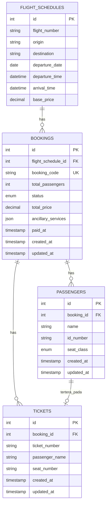

# Dokumentasi: Booking & Passenger Models + Migrations

## Ringkasan Perubahan

Sistem booking telah direfaktor untuk mendukung **multiple passengers per booking** dengan struktur database yang lebih terukur dan sesuai dengan arsitektur yang disepakati.

---

## 1. Model Relationships

### Booking Model
```
Booking (1)
    ├── has many Passengers
    ├── belongs to FlightSchedule
    └── has many Tickets
```

### Passenger Model
```
Passenger (*)
    └── belongs to Booking
```

### Relasi Database
```
bookings (1) ──── (*) passengers
   ↓
flight_schedules
```

---

## 2. Struktur Database

### Tabel: `bookings`

Setelah migration, struktur tabel adalah:

| Kolom | Type | Keterangan |
|-------|------|-----------|
| `id` | integer | Primary Key (auto increment) |
| `flight_schedule_id` | integer | Foreign Key ke flight_schedules |
| `booking_code` | string | Unique booking identifier (misal: BK-20260420-001) |
| `total_passengers` | integer | Jumlah total penumpang dalam booking |
| `status` | enum | `pending`, `paid`, `cancelled` |
| `total_price` | decimal | Total harga booking (currency format) |
| `ancillary_services` | json | Layanan tambahan (opsional) |
| `paid_at` | timestamp | Waktu pembayaran (nullable) |
| `created_at` | timestamp | Waktu pembuatan |
| `updated_at` | timestamp | Waktu update terakhir |

### Tabel: `passengers`

| Kolom | Type | Keterangan |
|-------|------|-----------|
| `id` | integer | Primary Key |
| `booking_id` | integer | Foreign Key ke bookings (ON DELETE CASCADE) |
| `name` | string | Nama penumpang |
| `id_number` | string (16) | ID Number (NIK) - 16 digit |
| `seat_class` | enum | `economy`, `business`, `first_class` |
| `created_at` | timestamp | Waktu pembuatan |
| `updated_at` | timestamp | Waktu update terakhir |

---

## 3. Migrasi Database

### Urutan Eksekusi (PENTING!)

Migrations **HARUS** dijalankan dalam urutan berikut:

1. **`2026_04_20_000000_create_passengers_table.php`** - Buat tabel passengers
2. **`2026_04_20_100000_migrate_bookings_data_to_passengers.php`** - Migrasi data dari bookings ke passengers
3. **`2026_04_20_200000_refactor_bookings_table.php`** - Hapus kolom dari bookings yang sudah pindah ke passengers

### Menjalankan Semua Migrasi:

```bash
php artisan migrate
```

Atau untuk reset database + seed:

```bash
php artisan migrate:fresh --seed
```

### Jika Ada Database Existing:

Jika Anda memiliki database yang sudah ada dengan bookings, pastikan:
1. Backup database terlebih dahulu
2. Jalankan migrasi baru
3. Verifikasi data di tabel passengers

```bash
# Verify migration status
php artisan migrate:status

# Rollback jika diperlukan
php artisan migrate:rollback --step=3
```

---

## 4. Model Usage

### Booking Model

```php
<?php

namespace App\Models;

use Illuminate\Database\Eloquent\Model;
use Illuminate\Database\Eloquent\Relations\BelongsTo;
use Illuminate\Database\Eloquent\Relations\HasMany;

class Booking extends Model
{
    protected $fillable = [
        'flight_schedule_id',
        'booking_code',
        'passenger_count',
        'ancillary_services',
        'status',
        'total_price',
        'paid_at',
    ];

    protected $casts = [
        'ancillary_services' => 'array',
        'total_price' => 'decimal:2',
        'paid_at' => 'datetime',
    ];

    public function flightSchedule(): BelongsTo
    {
        return $this->belongsTo(FlightSchedule::class);
    }

    public function passengers(): HasMany
    {
        return $this->hasMany(Passenger::class);
    }

    public function tickets(): HasMany
    {
        return $this->hasMany(Ticket::class);
    }
}
```

### Passenger Model

```php
<?php

namespace App\Models;

use Illuminate\Database\Eloquent\Model;
use Illuminate\Database\Eloquent\Relations\BelongsTo;

class Passenger extends Model
{
    protected $fillable = [
        'booking_id',
        'name',
        'id_number',
        'seat_class',
    ];

    protected $casts = [
        'created_at' => 'datetime',
        'updated_at' => 'datetime',
    ];

    /**
     * Relasi: Passenger milik Booking
     */
    public function booking(): BelongsTo
    {
        return $this->belongsTo(Booking::class);
    }
}
```

---

## 5. Contoh Penggunaan

### Create Booking dengan Multiple Passengers

```php
use App\Models\Booking;
use App\Models\Passenger;

// 1. Create booking
$booking = Booking::create([
    'flight_schedule_id' => 1,
    'booking_code' => 'BK-20260420-001',
    'total_passengers' => 2,
    'status' => 'pending',
    'total_price' => 7500000, // Untuk 2 penumpang
]);

// 2. Create penumpang pertama
$booking->passengers()->create([
    'name' => 'John Doe',
    'id_number' => '1234567890123456',
    'seat_class' => 'business',
]);

// 3. Create penumpang kedua
$booking->passengers()->create([
    'name' => 'Jane Doe',
    'id_number' => '6543210987654321',
    'seat_class' => 'business',
]);
```

### Query Booking dengan Passengers

```php
// Get booking dengan semua passengers
$booking = Booking::with('passengers')->find(1);

// Loop melalui semua passengers
foreach ($booking->passengers as $passenger) {
    echo $passenger->name . ' (' . $passenger->seat_class . ')';
}

// Filter booking berdasarkan jumlah passengers
$bookingsMultiPass = Booking::where('total_passengers', '>', 1)->get();

// Get passenger detail dengan booking info
$passenger = Passenger::with('booking')->find(1);
echo $passenger->booking->booking_code;
```

### Update Booking Status

```php
// Update status booking menjadi paid
$booking = Booking::find(1);
$booking->update([
    'status' => 'paid',
    'paid_at' => now(),
]);
```

### Delete Booking (dengan cascade delete passengers)

```php
// Menghapus booking akan otomatis menghapus semua passengers
$booking = Booking::find(1);
$booking->delete(); // semua passengers akan terhapus juga
```

---

## 6. Main Attributes (Atribut Utama)

Sesuai dengan requirement, sistem menggunakan atribut utama berikut:

| Atribut | Tabel | Kolom | Tipe |
|---------|-------|-------|------|
| `origin` | flight_schedules | origin | string |
| `destination` | flight_schedules | destination | string |
| `departure_date` | flight_schedules | departure_date | date |
| `passenger_count` | bookings | total_passengers | integer |
| `seat_class` | passengers | seat_class | enum |

### Akses Atribut dari Booking:

```php
$booking = Booking::with('flightSchedule', 'passengers')->find(1);

// Access flight details
echo $booking->flightSchedule->origin;        // CGK
echo $booking->flightSchedule->destination;  // DPS
echo $booking->flightSchedule->departure_date; // 2026-05-15

// Access booking details
echo $booking->total_passengers;  // 2

// Access passenger details
foreach ($booking->passengers as $passenger) {
    echo $passenger->seat_class; // economy, business, first_class
}
```

---

## 7. ERD (Entity Relationship Diagram)



---

## 8. Validasi Data

### Saat Create Passenger

```php
// app/Http/Requests/PassengerRequest.php
$validated = $request->validate([
    'name' => 'required|string|max:255',
    'id_number' => 'required|string|size:16|regex:/^[0-9]{16}$/', // 16 digit numeric
    'seat_class' => 'required|in:economy,business,first_class',
]);
```

### Saat Create Booking

```php
// app/Http/Requests/BookingRequest.php
$validated = $request->validate([
    'flight_schedule_id' => 'required|exists:flight_schedules,id',
    'total_passengers' => 'required|integer|min:1|max:9', // Maksimal 9 penumpang
    'seat_class' => 'required|in:economy,business,first_class',
    'status' => 'in:pending,paid,cancelled',
    'total_price' => 'required|numeric|min:0',
]);
```

---

## 9. Notes & Best Practices

1. **Cascade Delete**: Menghapus booking akan otomatis menghapus semua passengers terkait
2. **Booking Code**: Harus unique, dapat digenerate dari timestamp + running number
3. **Total Passengers**: Harus sama dengan jumlah records di passenger yang memiliki booking_id yang sama
4. **Front-end Validation**: Pastikan jumlah passengers input = total_passengers value
5. **Data Consistency**: Selalu gunakan transactions untuk create booking + passengers secara bersamaan

### Contoh dengan Transaction:

```php
use Illuminate\Support\Facades\DB;

DB::transaction(function () {
    $booking = Booking::create([
        'flight_schedule_id' => 1,
        'booking_code' => 'BK-' . now()->format('YmdHis'),
        'total_passengers' => 2,
        'status' => 'pending',
        'total_price' => 7500000,
    ]);

    foreach ($passengersData as $data) {
        $booking->passengers()->create($data);
    }

    // Jika ada error, semuanya akan di-rollback
});
```

---

Dokumen ini menjelaskan struktur lengkap Booking dan Passenger. Untuk pertanyaan lebih lanjut, lihat ARCHITECTURE.md atau IMPLEMENTATION_GUIDE.md.
