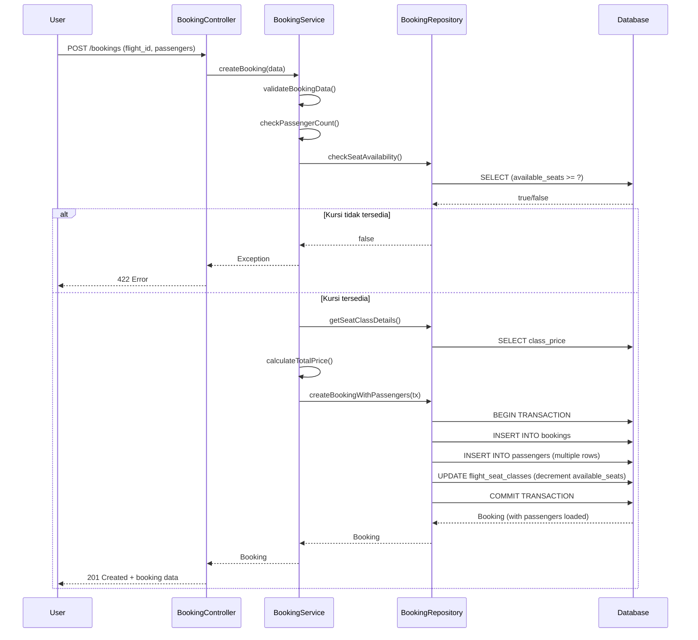

# 📦 Repository & Service Pattern - Booking System (US 2.4)

## Ringkasan

Dokumentasi ini menjelaskan implementasi **Repository Pattern** dan **Service Layer** untuk sistem booking pesawat dengan pengecekan ketersediaan kursi dan transaksi database yang atomik.

---

## 1. Arsitektur & Pattern

### Pola: MVC + Repository + Service Layer

```
┌─────────────────────────────────────────────────────────┐
│                    HTTP Request                          │
│              (BookingController)                         │
└────────────────────┬────────────────────────────────────┘
                     │
        ┌────────────▼────────────┐
        │   BookingService        │
        │  (Business Logic)       │
        │  - Validasi             │
        │  - Hitung harga         │
        │  - Cek ketersediaan     │
        └────────────┬────────────┘
                     │
        ┌────────────▼──────────────────┐
        │  BookingRepository (Interface)│
        │  (Abstraksi database)        │
        └────────────┬──────────────────┘
                     │
        ┌────────────▼──────────────────┐
        │  BookingRepository (Impl)     │
        │  (Query builder + Transaction)│
        └────────────┬──────────────────┘
                     │
    ┌────────────────┼────────────────┐
    │                │                │
  ┌─▼──┐          ┌─▼──┐          ┌─▼──┐
  │Book│          │Pass│          │Seat│
  │ings│          │enge│          │Clss│
  │    │          │r   │          │    │
  └────┘          └────┘          └────┘
```

---

## 2. Files Created

### 📄 Interface

**File:** `app/Repositories/Contracts/BookingRepositoryInterface.php`

Mendefinisikan kontrak (interface) untuk semua operasi booking di repository.

**Methods:**
- `checkSeatAvailability()` - Cek ketersediaan kursi
- `getSeatClassDetails()` - Dapatkan detail harga kelas
- `createBookingWithPassengers()` - Buat booking + passengers atomik
- `getBookingWithRelations()` - Ambil booking dengan relasi
- `getBookingByCode()` - Cari booking by code
- `decreaseAvailableSeats()` - Kurangi kursi tersedia
- `updateBookingStatus()` - Update status booking

### 📄 Repository Implementation

**File:** `app/Repositories/BookingRepository.php`

Implementasi interface dengan Eloquent query builder.

**Key Features:**
- ✅ Pengecekan ketersediaan kursi dengan WHERE clause
- ✅ Database transaction untuk atomicity
- ✅ Eager loading relasi untuk performa
- ✅ Eager loading relasi untuk performa

### 📄 Service Layer

**File:** `app/Services/BookingService.php` (UPDATED)

Business logic layer yang menggunakan BookingRepository.

**Key Methods:**
- `createBooking()` - Buat booking dengan passengers atomik
- `confirmPayment()` - Konfirmasi pembayaran
- Helper methods untuk validasi, price calculation, ticket generation

---

## 3. Key Pattern: Database Transaction

### Atomic Transaction di BookingRepository

```php
public function createBookingWithPassengers(
    array $bookingData, 
    array $passengersData
): Booking {
    return DB::transaction(function () use ($bookingData, $passengersData) {
        // 1. Create booking
        $booking = Booking::create($bookingData);
        
        // 2. Create passengers
        foreach ($passengersData as $passengerData) {
            $booking->passengers()->create($passengerData);
        }
        
        // 3. Decrease available seats
        $this->decreaseAvailableSeats(...);
        
        // 4. Return loaded model
        return $booking->load('passengers', 'flightSchedule');
    });
}
```

**Benefit:**
- ✅ Semua operasi dalam satu transaksi
- ✅ Jika ada error → otomatis rollback
- ✅ Menjamin data consistency

---

## 4. Pengecekan Ketersediaan Kursi

### Method: `checkSeatAvailability()`

```php
public function checkSeatAvailability(
    int $flightScheduleId,
    string $seatClass,
    int $passengerCount
): bool {
    return FlightSeatClass::query()
        ->where('flight_schedule_id', $flightScheduleId)
        ->where('seat_class', $seatClass)
        ->where('available_seats', '>=', $passengerCount)
        ->exists();
}
```

**Query yang dihasilkan:**
```sql
SELECT EXISTS (
    SELECT 1 FROM flight_seat_classes
    WHERE flight_schedule_id = ?
    AND seat_class = ?
    AND available_seats >= ?
)
```

### Implementasi di Service

```php
public function createBooking(array $data): Booking
{
    // ... validasi ...
    
    $seatClass = $passengersData[0]['seat_class'];
    
    // Cek ketersediaan
    if (!$this->bookingRepository->checkSeatAvailability(
        $flightScheduleId, 
        $seatClass, 
        $passengerCount
    )) {
        throw new \Exception(
            "Maaf, kursi {$seatClass} tidak tersedia untuk {$passengerCount} penumpang"
        );
    }
    
    // ... lanjut create booking ...
}
```

---

## 5. Flow: Create Booking Atomik

### Sequence Diagram



---

## 6. Contoh Penggunaan

### 6.1 Create Booking dengan Multiple Passengers

```php
use App\Services\BookingService;

// Inject service via dependency injection
public function store(BookingRequest $request, BookingService $bookingService)
{
    try {
        $data = [
            'flight_schedule_id' => 1,
            'passengers' => [
                [
                    'name' => 'John Doe',
                    'id_number' => '1234567890123456',
                    'seat_class' => 'business',
                ],
                [
                    'name' => 'Jane Smith',
                    'id_number' => '6543210987654321',
                    'seat_class' => 'business',
                ],
            ],
            'ancillary_services' => ['travel_insurance', 'extra_baggage'],
        ];

        $booking = $bookingService->createBooking($data);

        return response()->json([
            'success' => true,
            'booking_id' => $booking->id,
            'booking_code' => $booking->booking_code,
            'total_passengers' => $booking->total_passengers,
            'total_price' => $booking->total_price,
            'passengers' => $booking->passengers->toArray(),
        ], 201);

    } catch (\Exception $e) {
        return response()->json([
            'success' => false,
            'message' => $e->getMessage(),
        ], 422);
    }
}
```

### 6.2 Cek Ketersediaan Kursi Sebelum Booking

```php
use App\Repositories\BookingRepository;

public function checkAvailability(Request $request, BookingRepository $repo)
{
    $flightId = (int) $request->query('flight_id');
    $seatClass = $request->query('seat_class', 'economy');
    $passengerCount = (int) $request->query('passenger_count', 1);

    $isAvailable = $repo->checkSeatAvailability(
        $flightId,
        $seatClass,
        $passengerCount
    );

    if ($isAvailable) {
        $details = $repo->getSeatClassDetails($flightId, $seatClass);
        return response()->json([
            'available' => true,
            'available_seats' => $details->available_seats,
            'class_price' => $details->class_price,
        ]);
    }

    return response()->json(['available' => false], 409);
}
```

### 6.3 Konfirmasi Pembayaran

```php
public function confirmPayment(Request $request, BookingService $service)
{
    $bookingId = (int) $request->input('booking_id');
    $paymentStatus = $request->input('payment_status');
    $paymentMethod = $request->input('payment_method');

    $success = $service->confirmPayment(
        $bookingId,
        $paymentStatus,
        $paymentMethod
    );

    if ($success) {
        return response()->json(['success' => true, 'message' => 'Pembayaran berhasil']);
    }

    return response()->json(['success' => false], 422);
}
```

---

## 7. Error Handling

### Exception yang Mungkin Terjadi

| Exception | Penyebab | HTTP Code |
|-----------|---------|-----------|
| `InvalidArgumentException` | Input tidak valid | 422 |
| `Exception` (Kursi tidak tersedia) | Seat class kosong | 409 |
| `Exception` (Database) | Transaction rollback | 500 |

### Global Error Handling

```php
// app/Exceptions/Handler.php
public function render($request, Throwable $exception)
{
    if ($exception instanceof InvalidArgumentException) {
        return response()->json([
            'error' => 'Validation failed',
            'message' => $exception->getMessage(),
        ], 422);
    }

    if ($exception->getMessage() === 'Seat tidak tersedia') {
        return response()->json([
            'error' => 'Booking failed',
            'message' => $exception->getMessage(),
        ], 409);
    }

    return parent::render($request, $exception);
}
```

---

## 8. Transaction Rollback Scenarios

### Skenario 1: Kursi Habis Saat Create

```php
// Misal available_seats = 1, tapi 2 request concurrent
// request A: available = true
// request B: available = true
// request A: INSERT booking, UPDATE seats (OK)
// request B: INSERT booking, UPDATE seats (OK tapi seats negative)

// Solusi: Gunakan PESSIMISTIC LOCK
$seatClass = FlightSeatClass::query()
    ->where('flight_schedule_id', $flightId)
    ->where('seat_class', $seatClass)
    ->lockForUpdate()  // 👈 LOCK
    ->first();
```

### Skenario 2: Passenger Insert Gagal

```
INSERT booking (OK)
INSERT passenger 1 (OK)
INSERT passenger 2 (FAIL - unique constraint)
UPDATE seats (BELUM DIJALANKAN)
├─ Transaction: ROLLBACK
└─ Status: booking tidak ada, seats tidak berkurang ✅
```

---

## 9. Performance Considerations

### Query Optimization

```php
// ❌ Inefficient: Multiple queries
$booking = Booking::find($id);
$passengers = $booking->passengers;
$flight = $booking->flightSchedule;

// ✅ Efficient: Eager loading
$booking = Booking::with('passengers', 'flightSchedule')->find($id);
```

### Indexes untuk Query Performa

```sql
-- Flight seat class queries
CREATE INDEX idx_flight_seat_class_availability 
ON flight_seat_classes(flight_schedule_id, seat_class, available_seats);

-- Booking queries
CREATE INDEX idx_booking_code 
ON bookings(booking_code);

-- Passenger queries
CREATE INDEX idx_passenger_booking 
ON passengers(booking_id);
```

---

## 10. Testing

### Unit Test: Repository

```php
public function test_check_seat_availability()
{
    $flight = FlightSchedule::factory()->create();
    $seatClass = FlightSeatClass::factory()->create([
        'flight_schedule_id' => $flight->id,
        'seat_class' => 'business',
        'available_seats' => 5,
    ]);

    $repo = new BookingRepository();
    
    // Available
    $this->assertTrue($repo->checkSeatAvailability($flight->id, 'business', 5));
    $this->assertTrue($repo->checkSeatAvailability($flight->id, 'business', 3));
    
    // Not available
    $this->assertFalse($repo->checkSeatAvailability($flight->id, 'business', 6));
}
```

### Feature Test: Booking Service

```php
public function test_create_booking_with_multiple_passengers()
{
    $flight = FlightSchedule::factory()->create();
    FlightSeatClass::factory()->create([
        'flight_schedule_id' => $flight->id,
        'available_seats' => 10,
    ]);

    $service = new BookingService(new BookingRepository());
    
    $booking = $service->createBooking([
        'flight_schedule_id' => $flight->id,
        'passengers' => [
            [
                'name' => 'John',
                'id_number' => '1234567890123456',
                'seat_class' => 'economy',
            ],
            [
                'name' => 'Jane',
                'id_number' => '6543210987654321',
                'seat_class' => 'economy',
            ],
        ],
    ]);

    $this->assertCount(2, $booking->passengers);
    $this->assertEquals('pending', $booking->status);
    $this->assertEquals(9, $booking->flightSchedule->seatClasses->first()->available_seats);
}
```

---

## 11. Dependency Injection Setup

### Service Provider Registration

```php
// app/Providers/AppServiceProvider.php
public function register(): void
{
    // Bind interface ke implementation
    $this->app->bind(
        \App\Repositories\Contracts\BookingRepositoryInterface::class,
        \App\Repositories\BookingRepository::class
    );
}
```

### Constructor Injection

```php
// Di controller atau service
public function __construct(
    private readonly BookingRepository $bookingRepository,
    private readonly BookingService $bookingService
) {
}
```

---

## 12. File Structure

```
project/
├── app/
│   ├── Repositories/
│   │   ├── Contracts/
│   │   │   ├── FlightRepositoryInterface.php
│   │   │   └── BookingRepositoryInterface.php (NEW)
│   │   ├── FlightRepository.php
│   │   └── BookingRepository.php (NEW)
│   │
│   ├── Services/
│   │   ├── FlightSearchService.php
│   │   └── BookingService.php (UPDATED)
│   │
│   ├── Models/
│   │   ├── Booking.php
│   │   ├── Passenger.php
│   │   ├── FlightSchedule.php
│   │   ├── FlightSeatClass.php
│   │   └── ...
│   │
│   └── Providers/
│       └── AppServiceProvider.php
└── ...
```

---

## 13. Summary

### ✅ Implemented Features

- ✔️ Repository pattern dengan interface
- ✔️ Pengecekan ketersediaan kursi
- ✔️ Database transaction untuk atomicity
- ✔️ Multi-passenger support
- ✔️ Proper error handling
- ✔️ Eager loading untuk performa
- ✔️ Dependency injection
- ✔️ Following Laravel best practices

### 📊 Key Metrics

| Aspek | Detail |
|-------|--------|
| Files Created | 2 (Interface + Repository) |
| Files Updated | 1 (BookingService) |
| Methods | 8 di repository, 6 di service |
| Transaction Points | 1 (createBookingWithPassengers) |
| Seat Check | Atomic dengan booking creation |

---

**Dokumentasi lengkap untuk US 2.4 Backend Core & Database**

Untuk pertanyaan lebih lanjut, lihat file implementasi atau BOOKING_PASSENGER_GUIDE.md
