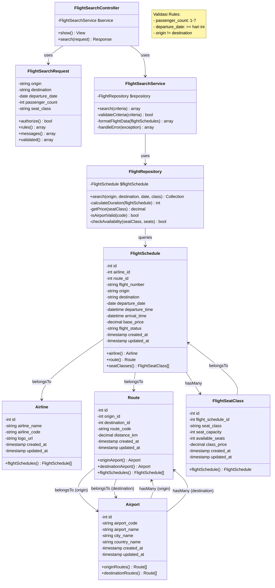

# Flight Search Engine — Class Diagram (Eloquent)

Diagram ini menggambarkan model domain penerbangan beserta atribut `$fillable`, cast numerik/tanggal yang didefinisikan di model, method relasi Eloquent, dan kardinalitas antar entitas.

## Catatan implementasi

- Kolom `timestamps()` (`created_at`, `updated_at`) ada di setiap tabel migrasi; tidak digambar di kotak class agar diagram tetap fokus pada domain.
- Atribut `origin` dan `destination` pada `FlightSchedule` adalah denormalisasi kode bandara (string); relasi kanonik trayek tetap melalui `route_id` → `Route` → `Airport`.
